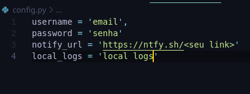

# Automação para Agendamento de Passaporte Italiano - Consulado SP

## Objetivo

Este script foi criado para facilitar a busca por horários disponíveis no consulado italiano em SP, mas pode ser utilizado em qualquer local do Brasil ou em sites em português.

## Como Usar

Este script foi testado e desenvolvido com o Python 3.12. Após instalar o Python, basta instalar as dependências usando o comando `pip install -r requirements.txt`. 

Existe a opção de receber notificações no celular caso algum horário esteja disponível. Para isso, é necessário configurar o aplicativo [Ntfy](https://ntfy.sh/) para receber as notificações.

Em seguida, crie um arquivo chamado `config.py` (imagem abaixo) e insira as configurações, como e-mail, senha e a URL do aplicativo de notificações, caso deseje receber notificações no celular.

## Passo a Passo - Configuração e Execução

1. Instale o [Python 3.12](https://www.python.org/downloads/release/python-3127/).
2. Instale as dependências executando `pip install -r requirements.txt`.
3. Baixe o aplicativo [Ntfy](https://ntfy.sh/) no celular para criar o link e receber notificações quando houver um horário disponível.
4. Configure o arquivo `config.py`, adicionando valores para as variáveis: `username` (e-mail), `password` (senha), `url` (link que o aplicativo Ntfy gera para receber notificações) e o local onde os logs serão criados (utilize o caminho de um diretório).
5. Execute o código com o comando `python main.py`.

## Como Funciona

O código roda em segundo plano, pois foi projetado para ser executado em um Raspberry Pi (onde ainda está rodando atualmente). 

Caso queira ver o código em execução, basta remover o parâmetro `--headless` no arquivo `main.py`. O script continuará rodando até encontrar um horário disponível. Caso o site detecte que é um bot, ele ajustará o tempo para a próxima requisição. Com base nos testes realizados, o site tende a responder com inatividade em horários específicos. Recomenda-se iniciar o script por volta das 8h da manhã e deixá-lo rodando ao longo do dia.

## Plataformas Testadas
1. Raspberry Pi
2. Linux
